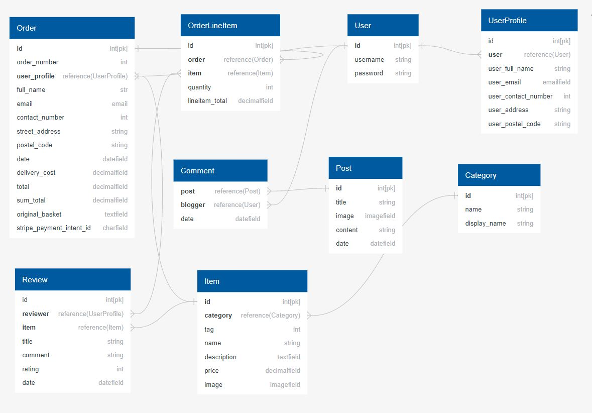

## AIM / PURPOSE

This is the last and final project milestone which aims to build and develop a full-stack web application using Python, Django, HTML, CSS, JavaScript, MySQL or Postgres, Stripe and external APIs. The main goal is to create an e-commerce web application for business purposes.
My main target is the food and beverage industry for my e-commerce web application.
My web application features e-commerce functionality, payments using Stripe, user login, blog section, review section for registered customers / users, email confirmation and notification, CRUD functionality for admin to access database records, add, edit, delete items, such as menu, information and blog.
This website is only for educational purposes, the Stripe functionality is set up to accept the test card, please do not enter your personal details, instead please use card details below.
 -Card number : 4242 4242 4242 4242
 - Any date
 - Any CCV number
 - Any 5 digits ZIP code

## User experiences

User Stories
#### Customer
 - As a Customer, I want to be able to view all of the available menu so that I can identify the image, price, information, and review 
 - As a Customer, I want to be able to view specific category from the available menu so that I can identify the image, price, information, and review which suitable for my diet
 - As a Customer, I want to be able to easily identify promotions, such as discounts and / or special offers so that I can Take advantage of extra savings on the menu and reduction of my total spending
 - As a Customer, I want to be able to view / access the interesting articles via blog so that I can to get useful knowledge and read interesting information about the food and traditions
 - As a Customer, I want to be able to easily see / display what I have searched for and the number of results so that I can quickly decide whether the food I want is available in the menu for order
 - As a Customer, I want to be able to select from the available the menu and manage / adjust the order quantity so that I can place the order into basket and easily make changes to my order before check-out
 - As a Customer, I want to be able to easily check my basket so that I can ensure I do not accidentally select the wrong products and / or quantity
 - As a Customer, I want to be able to easily check the total amount of my orde so that I can control and avoid unnecessary spending
 - As a Customer, I want to be able to easily enter my payment information in a secured process so that I can check-out quickly with no hassle and protected payment
 - As a Customer, I want to be able to feel my personal and payment information is safe and secure so that I can confidently provide the necessary information to place an order
 - As a Customer, I want to be able to view an order confirmation after check-out so that I can verify that my order has been placed and confirmed with no mistake
 - As a Customer, I want to be able to receive an email confirmation after check-out so that I can keep the confirmation of my order and able to track my transaction history as my records

#### Site User
 - As a site user, I want to be able to easily register/create an account so that I can have my personal account and be able to view my profile and transactions
 - As a site user, I want to be able to Receive an email confirmation after registering so that I can verify my account and ensure the registration was successful
 - As a site user, I want to be able to Easily login and / or logout so that I can access my personal profile, information and history transaction, also secure my account when not in use
 - As a site user, I want to be able to easily recover my password in case I forget about it so that I can Recover the access to my account and use the website
 - As a site user, I want to be able to have a personalized user profile so that I can recover the access to my account and use the website
 - As a site user, I want to be able to add reviews to the available menu so that I can provide useful feedback for other customers and help them to select the favorite menu
 - As a site user, I want to be able to add comments to the articles in the blog so that I can interact with other users or customers and share interesting information related to the articles
 - As a site user, I want to be able to search the menu by name and/or description so that I can find a specific food from the available menu which I like to order
 - As a site user, I want to be able to sort the list of available menu so that I can easily identify the menu by cheapest price, most expensive price  and alphabetical order
 - As a site user, I want to be able to sort a specific category from the available menu so that I can easily find the menu from specific category by cheapest price, most expensive price  and alphabetical order to suit my diet

#### Admin User
 - As an Admin user, I want to be able to add a new menu so that I can introduce new menu to my customers
 - As an Admin user, I want to be able to edit/update a menu so that I can change the prices, descriptions, images and other information of the food
 - As an Admin user, I want to be able to delete a menu so that I can remove menu which are no longer available
 - As an Admin user, I want to be able to add a new article to the blog so that I can allow users and customers to find and read new interesting article and information
 - As an Admin user, I want to be able to edit/update an article in the blog so that I can change the details in the article to reflect the latest information
 - As an Admin user, I want to be able to delete an article in the blog so that I can remove obsolete articles from the blog


## Wireframes

- As an initial process of the project design, wireframes were created for desktop, iPad and mobile screen sizes using [Balsamiq](https://balsamiq.com/).

* Desktop Wireframe - [View](readme-files/wireframes/wireframe-ms4-desktop.pdf)

* iPad Wireframe - [View](readme-files/wireframes/wireframe-ms4-ipad.pdf)

* Mobile Wireframe - [View](readme-files/wireframes/wireframe-ms4-mobile.pdf)


### Database models and schema
#### Models
- Profiles
  - User
    - From Django Allauth containing the username, email, and password.
  - Userprofile
    - Model containing the user's details for delivery and future order.

- Menu
  - Items
    - Contains the item information of each items on the page
  - Categories
    - The categories for the each of the items.

- Checkout
  - Order
    - Information on customer's details and order placed by customers.
  - Orderline item
    - Information on the customer order, quantity and the total.

- Reviews
  - Review
    - details of reviewer, review title, description and date of review

- Blog
  - Post
    - the blog post and details of blogger and post title.
  - Comments
    - Comments added by users on each post 

- Database Diagram

  - The database diagram of this project was created by using [Quick Database Diagrams](https://www.quickdatabasediagrams.com/) diagram shows a list of the fields in each object and relationships between each object.

    <div align="center"></div>

## Technologies Used

### Languages Used
- [Python](https://www.python.org/)
    - I have used  **Python** as the back-end programming language for my project.
- [HTML](en.wikipedia.org/wiki/HTML)
    - I have used **HTML** as the main structural element of my project.
- [CSS](https://en.wikipedia.org/wiki/Cascading_Style_Sheets)
    - The project uses **CSS** to style and theme pages..
 - [Javascript](https://en.wikipedia.org/wiki/JavaScript)
    - The project uses **Javascript** to allow for DOM manipulation.

### Frameworks, Libraries, extensions and Resources Used  
- [Django](https://www.djangoproject.com/)
  - Django was used to create the project.
- [Django Allauth](https://django-allauth.readthedocs.io/en/latest/)
  - Django allauth was used to create the user sign-in function for the site.
- [Django Crispy Forms](https://django-crispy-forms.readthedocs.io/en/latest/)
  - Django Crispy Forms were used to utilise the bootstrap form classes.
- [Stripe](https://stripe.com/ie)
  - Stripe has been used for the payment section of the site.
- [Amazon AWS](https://aws.amazon.com/)
  - Amazon AWS was used to store the static files and the images for the site.
- [Quick Database Diagrams](https://www.quickdatabasediagrams.com/)
  - quick database diagrams was used to make a diagram of database schema.
- [JQuery](https://jquery.com)
  - The project uses **jQuery** as the primary JavaScript functionality. This is both the standard jQuery that is built with Materialize components, and my custom jQuery used in my script.js file. 
- [Bootstrap 4](https://getbootstrap.com/)
  - Bootstrap 4 was used for its grid system and its form inputs and its helper classes to make page responsive with minimum code.       
- [Google Fonts:](https://fonts.google.com/)
    - Google font was used to embed the Dosis types font which are used on all pages throughout the website.
- [Font Awesome:](https://fontawesome.com/)
    - Font Awesome was used to add icons for aesthetic and UX purposes.
- [Balsamiq:](https://balsamiq.com/)
    - Balsamiq was used to create the wireframes during the design process.
- [Gitpod](https://www.gitpod.io/)
    - Gitpod was used as IDE for local development.
- [GitHub](https://github.com/)
    - GitHub was used to store the projects code after being pushed from Gitpod.
- [Git](https://git-scm.com/)
  - Git was used as aversion control system to regularly and add commit changes made to project and pushing them to GitHub
- [Gunicorn](https://gunicorn.org/)
  - Gunicorn was used for deploying the project to Heroku.
- [Heroku](https://id.heroku.com/login)
  - Heroku was used as the hosting platform to deploy my project.
- [HTML Formatter](https://htmlformatter.com/) 
    - HTML formatter was used to format HTML code
- [Unicorn Revealer](https://chrome.google.com/webstore/detail/unicorn-revealer/lmlkphhdlngaicolpmaakfmhplagoaln/related) 
    - Unicorn Revealer tool was used to identify any overflow issues
- [Lighthouse](https://developers.google.com/web/tools/lighthouse)
    - Lighthouse was used to test the performance and loading speed of the website
- [Am I responsive](http://ami.responsivedesign.is/)
  - Am I responsive was used to taking screenshots of the page at different screen sizes.
- [W3.CSS](https://www.w3schools.com/w3css/defaulT.asp) 
    - General resources.
- [Stack Overflow](https://pt.stackoverflow.com/)
    - General resources.
- [Youtube](https://www.youtube.com/) 
   - General resources.
- Code Institute SLACK Community
   -General resources

## Code Validation

- [W3C Markup Validation](https://validator.w3.org/#validate_by_input) 
  - W3C Markup Validation was used throughout the process to validate HTML codes
- [W3C CSS Validation](https://jigsaw.w3.org/css-validator/) 
  - W3C CSS Validation was used to vaildate CSS codes
- [JSHINT](https://jshint.com/) 
  - JSHINT was used for JavaScript code warning & error check.
- [PEP8 online](http://pep8online.com/)
  - PEP8 online tool was used to ensure all python codes on projects are PEP8 compliant.
- [Python Tutor](https://pythontutor.com/visualize.html#mode=edit)
  - Python tutor was used to visualize the python code and identify any error.


## Issues and Resolutions

- Error message appeared when I was making migration after creating models for menu app.
  - this was an easy fix as error message was clearly indicating that project required to install Pillow in order to complete migration therefore I ran pip3 install Pillow command in my terminal to install Pillow and re ran makemigration command, once Pillow installed I did not see any error message while making migrations.

- When I use python3 manage.py loaddata menu command , error message shown on terminal indicating problem installling fixtures and Could not load menu.Item, this was quite challanging for me to understand the actual issue as I have checked any possible spelling errors or any name mismatch on models.py file, admin.py file and also file names on my project however could not spot any error. After spending almost 45 min on google research I have somohow found that I needed to make new migration to fix this issue, as I made changes to modal and renamed as Item which was previously named as menu which I suspected as an issue. I ran below commands step by step on my terminal which then fixed issue.
    ```
    python3 manage.py makemigrations --dry-run
    Migrations for 'menu':
    menu/migrations/0002_auto_20210930_1748.py
    - Create model Item
    - Delete model Menu

    python3 manage.py makemigrations
    Migrations for 'menu':
    menu/migrations/0002_auto_20210930_1749.py
    - Create model Item
    - Delete model Menu

    python3 manage.py migrate --plan
    Planned operations:
        menu.0002_auto_20210930_1749
        Create model Item
        Delete model Menu

    python3 manage.py migrate
    Operations to perform:
        Apply all migrations: account, admin, auth, contenttypes, menu, sessions, sites, socialaccount
    Running migrations:
        Applying menu.0002_auto_20210930_1749... OK 
    ```

- I was testing my live site after creating menu app and during test images used on menu template did not displayed on browser however alt attributes were working fine, in this case I thought it was definitely naming mismatch and start cross checking the images name however I couldnt see any error on this. Finally after doing some resaerch on ***how to render images using django*** I understood that my template required image url as I had imageField in my model/database and this required to supply image url while passing to template. I have updated image url to my template accordingly and this fixed issue.
    ```
    before
    

    after
    
    ```

- Issue with scrolling behavior as upon clicked on up-arrow icon, page did not scroll back to the top. I could not see any issue with my codes in HTML and jQuery and decided to checked on dev tool console and noticed there was an error which stating as below:
   ```
   Uncaught TypeError: $(...).fadeOut is not a function
   Uncaught TypeError: $(...).fadeIn is not a function
   ```
   - I then did further research on the console error and found that I needed to ***update the CDN for jQuery*** on my file, I was using ***slim version of jQuery*** which was causing an issue as only full version of jQuery support animation effects. I have then replaced slim version on jQuery CDN with full version which then solved my problem.

- After I create functionality to add and update items on the basket, I was testing the site on browser however update functionality didnt worked and quantity increased/decreased by 2 everytime on a single click to ***+*** and ***-*** button.
   - I then checked all codes on my views and html file line by line and spotted 2 issue which causing above issue and everything worked as expected after I addressed those issues.
    - I was using script tag to load javascript files on both of the templates i.e , base template and basket template which causing an issue as this resulted action to perform twice and resulted quantity doubled everytime when  ***+*** or ***-*** button clicked, I have then removed script tag from basket template which then resolve this issue.
    - Update option on the basket page did not work upon clicking to it after modifying the item quantiy as quantity and price remained unchanged after modifying the quantity and clicking update option. This issue was causing by naming mismatch while creating views to update basket, input element inside the form had ***name=quantity*** however on views.py file I was using ***item_quantity*** while retriving name from the input element using request.get method this was causing an issue. I have updated this on my views according to the HTML template which fixed this issue
        ```
        before:
        - quantity = int(request.POST.get("item_quantity"))

        after:
        - quantity = int(request.POST.get("quantity"))
        ```

- I have encountered similar issue while testing remove option as it didnt worked and upon checking on terminal there was an error shown, I have done some research on the error and fixed everything as per some information I found on stack overflow and google however same error was shown on terminal , then I reached out to CI tutor support team and as per tutor advised I needed to move the remove part of JS code to my html file which was on static file, which then solved issue. as per tutor advice, for some reason Django post security is not allowing the post request to be successful which is causing a 500 error, which is bit strange to me and I am looking to do further research and study on this. Furthermore I have then decided to move JS code for both update and remove functionality to the bottom of HTML file just to make it simple to understand.

- I had an issue with payment form after adding stripe payment functionality to my checkout page which took me really long time to fix, after completing all the stripe requirements, writting views, signals and javascript codes I was testing the payment form on my browser however testing failed an I was keep getting Django error all the time. I then did massive research on google, slack and stackoverflow to understand the issue and found that similar issue was raised many times however I was not clearly able to understand what causing an issue due to code complexity of the project. I have then approached to tutor support team from CI and tutor advised me that Issue is happen due to I have used the variable before its assignment which was same as error shown on Django. I then strat checking checking all codes one by one and I could not figured out as I set variable named ***intend*** and only used the variable way below its assign. I have the started to analyse and chekeing the indentation line on my workspace and noticed that I set the variable inside the else block but using outside the else block which was the reason of problem, I then simply decided to delete else statement as this was not necessarily required, once I delete the else and update indentetion level issue then ressolve.

- There was another issue again with my form, after I submit the form there was an error message shown on the page, I have checked on the stripe dashboard and payment was received however issue trigerred the error message indicating that there was an issue with my form, I have added some print statements on my code to check the outcome in the terminal and indeed it was appeared to have an issue with the form validation as form was not valid, then I double checked on the form field in my views.py and forms.py and found that was I missing one field while creating form_data on views.py which was causing problem. door_no was assigned as one of the form field on forms.py however this was missing on views.py. Issue ressolve once I updeted door_no field on views.py

- I was still getting django error after fixing all the issue above and this time issue was related to my model which django was clearly indicating. This also became very complicated and difficlut for me to understand therefore I had to reach out to tutor support : Thanks to igor from tutor support team who have superbly advise me on few concepts on ***class and self*** method and this concept helped me to understand the issue : I had some functions in models.py to update the item price however those function were indented inside the wrong class and causing issues which fixed once I move them within the correct class.

- Unfortunately this remained still unsuccessful and I was still having an error, django was throwing an attribute error on my checkout app, this was quite straightforward for me to investigate as django was clearly telling that ***'Order' object has no attribute 'update_total'*** , I then start checking all of my files inside my checkout app and found that there was an issue on signals.py. I had used update_total in my signal instead of update_sum_total and this fixed after I have corrected this.

- After I added webhook to my project, I was using stripe dashboard to test the webhook however test failed and I was keep getting various error code ***502***, ***400***, ***400***. After doing some research on google and slack channel, I found the few ways to check thhis issue further. I ran echo command on my terminal to double check that all of the stripe and webhook secret key is set correctly however when I ran ***echo $STRIPE_WEBHOOK_SECRET*** command on my terminal nothing was shown which was enough for me to understand that webhook secret key was not accessible to my workspace from GitPod env variables. I have then checked on my gitpod setting and compare the varible name against the variable name in my settings.py then I found an issue. Variable name assigned in settings.py was different from the variable name set on my gitpod setting, additionally I checked on webhooks.py file and spotted same issue there. I have then updated my variable across all the settings which then ressolved the problem.

- I was still having an issue while testing the checkout functionality, I created and submit complete one order after completing the payment form, as a result of this form was submitted and order confirmation displayed on page however there was still ***401 error shown*** while checking the events on stripe and also two of the input field (Original basket and Stripe payment intend id) had empty field while checking the order from admin. I had done some further research on 401 error and found the solution of this problem over slack community channel. Issue here was my workspace was not shared at the time of the test which means webhook was not connected to the site. I have then shared my workspace and re-check the functionality again by creating another order and this time all the fields were populated while checking on admin, also no issue on stripe and code 200 was shown.

- Issue with form field on Profile app: after building the functionality to store and display user profile, I was testing the functionality on the live site and spotted 2 issues as below :
  - Full name field and address field on the form appeared empty once info saved to profile and viewed from my profile option
    - I checked for any possible error on speeling and assigned value on forms.py, models.py and views.py however couldnt see any issue. I then run some print statement on address and full name field and noticed nothing printed on terminal, I then check on my weebhook view and JS code. somehow I have noticed that I had naming mismatch on couple of field for address and fullname, also i was using incorrect get method to retrive the user's name so I had to correct all the address mismatch and update get method, after this process I saw that details were printed on terminal and upadted on profile accordingly.

  - Placeholders text on the profile page form were not showing for address and contact number field.
    - I have checked all the possible errors on my view and form and couldnt spot any issue, I have then did plenty of research on google/slack but no tips found. Thanks to tutor support team from CI who advised me to check the indentation, indeed It was just as very silly error on form.py as I intended the if block incorrectly which resulted this issue and resolved once indentation fixed.

- Issue on admin profile while adding the item image: while admin adding the new item to the page I created an option to add the item without any image too however in this case default image should be displayed on the page indicating item has no image but this process failed while testing and default image did not showed on the item image. I built an if statement on all image tag to ensure default image to be only display if item has no image but for some reason this failed.
  - First this for at this stage was to check django setting for MEDIA_URL variable as this variable was used in template fo no image, I then checked any possible issue on if/else block and across all the settings and view but couldnt see any issue. Upon checking on Slack/Google and stack overflow I have seen plenty of post related to this issue however none of the post helped me as I had all setting correct. Finally I decided to check on the Django documantation page and [I found the solution over there](https://docs.djangoproject.com/en/3.2/ref/settings/), I simply needed to add below to the context_processors of my django setting
    ```
    'django.template.context_processors.media',
    ```


 

## Deployment
- This project was initially set up on GitHub using the Code Institue Gitpod Template. I have used the Code Institute gitpod template and named my repository.
- After creating repository in github I then open the repository with Gitpod using green GitPod button on the github page.
- I then use gitpod terminal throughout the build process to install library/packages and to create folders and files
- git was used throughout the build process of this project as version control to Github
  - git add was used to add the files to staging area
  - git commit was used to commit my work with commit message
  - git push was used to updates my committed changes and allows send them to remote repository.

- Project was deployed to Heroku and process for setup and deployment are as below:

#### Heroku setup
1. Login to [Heroku](https://id.heroku.com/login) and create the app using create app button on heroku website once logged into the page.
2. Give the desire name to the app and choose a region (In my case I have named my app as neupane-kitchen and choose a region as Europe)
3. At this point, app has been created then click the resourses option and search for Heroku Postgres on add-ons section
4. Select the Provision plan, for this project I have use the free plan by selecting ***Hobby Dev - Free*** plan
5. In order to use Postgres few install requirement on gitpod workspace, head up to gitpod terminal and use CLI below to install ***jango database and psycopg2-binary***
   ```
   pip3 install dj_database_url
   pip3 install psycopg2-binary
   ```
6. freeze the requirements using below CLI to make sure Heroku installs all the apps requirements when deployed.
   ```
   pip3 freeze > requirements.txt
   ```

#### Database Setup 
1. Go to settings.py on project level app and import dj_database_url
   ```
   import dj_database_url
2. update database setting as on the settings.py
   ```
   DATABASE = {
       'default' : dj_database_url.prase(<database url form heroku>)
   }
   note: database url can be obtained from heroku config vars ( go to setttings on heroku dashboard and click 'Reveal Config Vars') Or from the command line by typing Heroku config
   ```
3. Run the migrations and get database setup 
   ```
   python3 manage.py migrate
   ```
4. import the items data to the database by using below command
   ```
   python3 manage.py loaddata categories
   python3 manage.py loaddata menu
   
   note : ensure categories is loaded first as items depends on categories
   ```
   
5. create supersuser to login with by typing python3 manage.py createsuperuser in the terminal.
   ```
   gitpod /workspace/neupane-kitchen $ python3 manage.py createsuperuser
   Username (leave blank to use 'gitpod'): shiva123
   Email address: sb4_cbu@yahoo.com
   Password: 
   Password (again): 
   Superuser created successfully.
   ```
6. install gunicorn and also create Procfile to tell Heroku to create web dyno
   ```
   pip3 install gunicorn

   and freeze the requirement
   pip3 freeze > requirements.txt
   ```
7. Use below command to install and login to heroku from terminal
   ```
   type npm install -g heroku on terminal

   type heroku login -i to login 
      gitpod /workspace/neupane-kitchen $ heroku login -i
      heroku: Enter your login credentials
      Email: sb4_cbu@yahoo.com
      Password: ***********
      Logged in as sb4_cbu@yahoo.com

   type heroku apps to see all the apps
     gitpod /workspace/neupane-kitchen $ heroku apps
       === sb4_cbu@yahoo.com Apps
           neupane-kitchen (eu)
           one-stop-solution (eu)
    ```
 8. Disable collect data to avoid heroku from collecting static data when project is deployed initially. 
    ```
    heroku config:set DISABLE_COLLECTSTATIC=1 --app <app name>
    note : -- app flag required if project has more than one app
    ```
 9. Back in the settings.py update ALLOWED_HOSTS as below
    ```
    ALLOWED_HOSTS = ['<app name>.herokuapp.com', 'localhost']
    note : localhost added on ALLOWED_HOST to ensure gitpod will still work too.
    ```
 #### Deploy to Heroku
 - After git add and git push command, below steps were taken to deploy the app to heroku from the terminal 
    
 - first type heroku git:remote -a <heroku app name> on terminal
    (note : above command required to initialize the heroku git remote due to app was created from Heroku website directly (not with CLI))
       
 - then type git push heroku main on the terminal 

    ```
             gitpod /workspace/neupane-kitchen $ git push heroku main
             Enumerating objects: 1027, done.
             Counting objects: 100% (1027/1027), done.
             Delta compression using up to 16 threads
             Compressing objects: 100% (853/853), done.
             Writing objects: 100% (1027/1027), 12.87 MiB | 7.68 MiB/s, done.
             Total 1027 (delta 496), reused 16 (delta 0), pack-reused 0
             remote: Compressing source files... done.
             remote: Building source:
             remote: -----> Building on the Heroku-20 stack
             remote: -----> Determining which buildpack to use for this app
             remote: -----> Python app detected
             remote: -----> No Python version was specified. Using the buildpack default: python-3.9.7
             remote:        To use a different version, see: https://devcenter.heroku.com/articles/python-runtimes
             remote: -----> Installing python-3.9.7
             remote: -----> Installing pip 20.2.4, setuptools 57.5.0 and wheel 0.37.0
             remote: -----> Installing SQLite3
             remote: -----> Installing requirements with pip
             remote:        Collecting asgiref==3.4.1
             remote:          Downloading asgiref-3.4.1-py3-none-any.whl (25 kB)
             remote:        Collecting dj-database-url==0.5.0
             remote:          Downloading dj_database_url-0.5.0-py2.py3-none-any.whl (5.5 kB)
             remote:        Collecting Django==3.2.7
             remote:          Downloading Django-3.2.7-py3-none-any.whl (7.9 MB)
             remote:        Collecting django-allauth==0.45.0
             ................................................
             .................................
             remote: -----> Compressing...
             remote:        Done: 81.6M
             remote: -----> Launching...
             remote:        Released v6
             remote:        https://neupane-kitchen.herokuapp.com/ deployed to Heroku
        
    ```
         
 - Project is now deployed to Heroku.


  
 #### Automatic Deploy to heroku.
 - Visit heroku website and select the app and click on Deploy option
 - Scroll down to Deployment method option and select connect to Github option and type the name of github repository on search field
 - Select connect option and now heroku app is connected to github repo.
 - Scroll further down on deploy option on dashboard and select ' Enable Automatic Deploy' option in order to automatic deployment everytime when the work is is pushed to github.
 - Automatic deployment process can be checked by selecting activity option on heroku dashboard once work is pushed to github, below is the snapshot of building activity from heroku dashboard

    ```
      -----> Building on the Heroku-20 stack
      -----> Using buildpack: heroku/python
      -----> Python app detected
      -----> No Python version was specified. Using the same version as the last build: python-3.9.7
       To use a different version, see: https://devcenter.heroku.com/articles/python-runtimes
      -----> No change in requirements detected, installing from cache
      -----> Using cached install of python-3.9.7
      -----> Installing pip 20.2.4, setuptools 57.5.0 and wheel 0.37.0
      -----> Installing SQLite3
      -----> Installing requirements with pip
      -----> Skipping Django collectstatic since the env var DISABLE_COLLECTSTATIC is set.
      -----> Discovering process types
       Procfile declares types -> web
      -----> Compressing...
       Done: 81.7M
      -----> Launching...
       Released v8
       https://neupane-kitchen.herokuapp.com/ deployed to Heroku

    ```


### Making a Local Clone 

   - Following setps required to clone the project to the local machine.
     - Log in to GitHub and locate the GitHub Repository
     - Under the repository name, click "Clone or download".
     - To clone the repository using HTTPS, under "Clone with HTTPS", copy the link.
     - Open Git Bash on computer (Command Prompt can also be use instead of git bash) 
     - Change the current working directory to the location where you want the cloned directory to be made.
     - Type git clone, and then paste the URL you copied in Step 3.
        
        ```
        git clone https://github.com/shiva123-coder/neupane-kitchen.git
   
        ```

       - Press Enter. Your local clone will be created.
          
         ```
         Cloning into 'neupane-kitchen'...
         remote: Enumerating objects: 1061, done.
         remote: Counting objects: 100% (1061/1061), done.
         remote: Compressing objects: 100% (590/590), done.
         Receiving objects:  91% (966/10remote: Total 1061 (delta 521), reused 832 (delta 296), pack-reused 0
         Receiving objects:  92% (977/1061
         Receiving objects: 100% (1061/1061), 12.89 MiB | 7.06 MiB/s, done.
         Resolving deltas: 100% (521/521), done.

         ```


     - In order to use the full functionality of the site following environment variables must be set up

       - SECRET_KEY = <secret key>.

       - STRIPE_PUBLIC_KEY = <stripe public key>

       - STRIPE_SECRET_KEY = <stripe secret key>

       - STRIPE_WEBHOOK_SECRET = <stripe webhook secret>

       - IN_DEVELOPMENT = True
     
     - Additionally project required to install all the required packages and dependecies which can be installed by using the following command
      
       ```
       pip3 install -r requirements.txt

       ```


     - Last step is to migrate the models to set up database by using commands below
       
       ```
        python3 manage.py makemigrations --dry-run    # check 
        
        python3 manage.py makemigrations              # make migrations

        python3 manage.py migrate --plan              # check migration plan

        python3 manage.py migrate                     # migrate

       ```

     - Now project can be run by using the command below

       ```
       python3 manage.py runserver

       ```

## Amazon Web Service (AWS)

  - AWS was used in this project to host static and media files for this project.
  - AWS account was creating by completing the sign-up process through the [AWS website](https://aws.amazon.com).

1.  Create the bucket
    - Below steps were taken to create the bucket
        - Create a new bucket on the AWS S3 service
        - From the main dashboard search for S3 and then select get started option
        - Select Create bucket button and give the bucket name and select your region
        - Uncheck the block public access and acknowledge that the bucket will now be public
        -  Select create bucket.
    
2. Bucket settings.
   - Select bucket properties settings and turn on static website hosting
   - Add index.html to index field and  and error.html to the error and save.

   - Select bucket Permissions settings now, click on the buckets Permissions tabs and add below config :
       ```
       [
          {
              "AllowedHeaders": [
                  "Authorization"
              ],
              "AllowedMethods": [
                  "GET"
              ],
              "AllowedOrigins": [
                  "*"
              ],
              "ExposeHeaders": []
          }
       ]

       ```
    - On the bucket policy option, click on generate policy and Select S3 bucket policy
    - Add * to the principal field to select all principals
    - Choose the action to get object.
    - Paste in your ARN which is available on the previous page.
    - Click, add statement
    - Then click, generate policy.
    - Now copy and paste your new policy into the bucket policy.
      ```
      {
         "Version": "2012-10-17",
         "Id": "Policy1635692466356",
         "Statement": [
            {
                  "Sid": "Stmt1635692462924",
                  "Effect": "Allow",
                  "Principal": "*",
                  "Action": [
                     "s3:GetObject",
                     "s3:PutObject",
                     "s3:DeleteObject"
                  ],
                  "Resource": "arn:aws:s3:::neupane-kitchen/*"
            }
         ]
      }

      ```

    - Add /* onto the end of the resources key
    - Click Save.
    - Access control list
    - In the access control list tab set the list objects permission to everyone.
    
3. Create a User

   - Back in the AWS main dashboard search for IAM and follow the process below : 
    - Firstly create a group to put user in.
    - Click create a new group and name it.
    - Click through to the end and save the group.
    - Create a policy.
    - In our group click, policy and then, create policy.
    - Select the JSON tab and then import managed policies.
    - Search S3 and select AmazonS3FullAccess and import.
    - In the resources section paste in our ARN from before.
    - click through to review the policy.
    - Fill in name and description and then click generate policy.
    - Back in your group click permission and then attach the policy.
    - Find the policy which is just created and attach it.
    

    - Select Users from the sidebar and then click, add user.
    - Create a user name and select programmatic access then click next.
    - Then select your group to add your user to.
    - Click through to the end and then click create user.
    - download the CVS file and save it as it contains the users keys

    (note: CVS file must be download and keep it safe/secret at this stage as after this process its not possible to download CVS file again)

4. Connecting to Django
  - Once AWS has been set up now this needs to be connect to Django. Steps below were taken to accomplish this.
   - Head up to the gitpod terminal and use below command to install ***boto3 and django storages*** packages

      ```
       pip3 install boto3
       pip3 install django-storages
      ``` 

    
   - Then freeze the requirements by using below command in the terminal
       ```
       pip3 freeze > requirements.txt
       ```
   - Back to the settings.py add some settings as below:
   - first add storages into installed apps in settings.py
   - Back to heroku setting scroll down to 'Reveal config var' and create an environmental variable "USE_AWS" and set it to True in order only run this code when on Heroku.
   - Now add below settings to the settings.py
    
       ```
           if "USE_AWS" in os.environ:

                # Bucket Config

                AWS_STORAGE_BUCKET_NAME = '<bucket name>'
                AWS_S3_REGION_NAME = '<your region>'
                AWS_ACCESS_KEY_ID = os.environ.get('AWS_ACCESS_KEY_ID')
                AWS_SECRET_ACCESS_KEY = os.environ.get('AWS_SECRET_ACCESS_KEY')
                AWS_S3_CUSTOM_DOMAIN = f'{AWS_STORAGE_BUCKET_NAME}.s3.amazonaws.com'

                # static and media file storage
                
                STATICFILES_STORAGE = 'custom_storages.StaticStorage'
                STATICFILES_LOCATION = 'static'
                DEFAULT_FILE_STORAGE = 'custom_storages.MediaStorage'
                MEDIAFILES_LOCATION = 'media'

                # Override static and media URLs in production

                STATIC_URL = f'https://{AWS_S3_CUSTOM_DOMAIN}/{STATICFILES_LOCATION}/'
                MEDIA_URL = f'https://{AWS_S3_CUSTOM_DOMAIN}/{MEDIAFILES_LOCATION}/'

        ```
    
  - Create a custom_storages.py file on workspace to tell Django that in production we want to use s3 to store our static and media files.
  - import S3Boto3Storage to the top of the custom_storages.py file
  - Create new classes inside the custom_storages.py file and add location variable as below.


    ``` 
        class StaticStorage(S3Boto3Storage):
        location = settings.STATICFILES_LOCATION

        class MediaStorage(S3Boto3Storage):
        location = settings.MEDIAFILES_LOCATION
    ```
  - All setup process has now completed.

5. Add media to AWS.
   - Below steps were taken to add the media to AWS
   - Head back to AWS s3 and create a new folder called media.
   - Select upload and add image files.
   - Then select to grant public access.
   - And then upload the files.
   


## Credit
- Thanks to JustDjango on their [youtube video](https://www.youtube.com/watch?v=cdRj9eNR0KI) on stripe payment, this video help me to understand the handling of validation and error while creating stripe payment functionality.


 - ***Code***
  - I have taken some CSS and JS code from CI walkthrough project and modified as per project requirement while creating loading spinner in checkout section of the project
  - I have taken the code from [stackoverflow](https://stackoverflow.com/questions/16344354/how-to-make-blinking-flashing-text-with-css-3) and modified as per my requirement while creating animation effect on my delivery promo text on Navbar.