## Testing

## Table of Contents

- [Code Validation](#code-validation)
  - [HTML Codes](#html-codes)
  - [CSS Codes](#css-codes)
  - [Javascript Codes](#javascript-codes)
  - [Python Codes](#python-codes)
- [Testing User Stories](#testing-user-stories)
  - [Customer](#customer)
  - [Site User](#site-user)
  - [Admin User](#admin-user)

## Code Validation
### HTML Codes
- [W3C Markup Validation](https://validator.w3.org/#validate_by_input) 
  - W3C Markup Validation was used throughout the process to validate HTML codes, all codes passed the test without any error

    
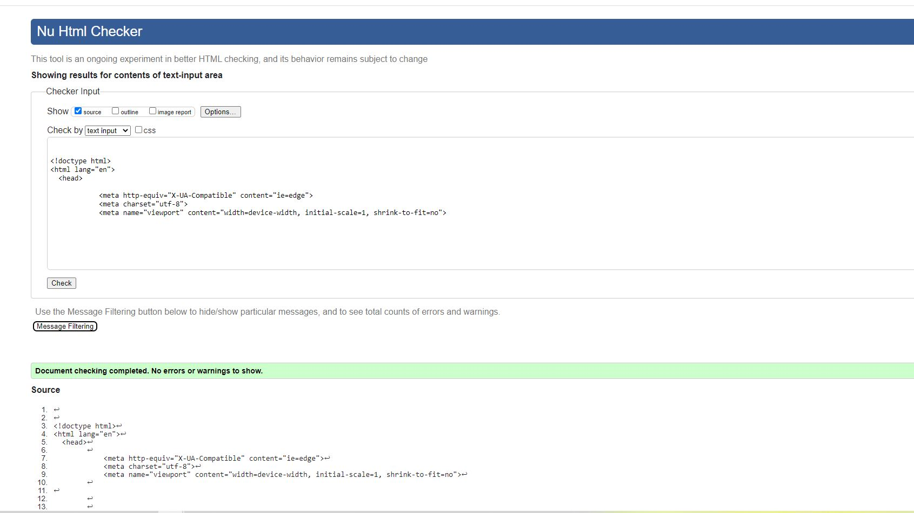

### CSS Codes
- [W3C CSS Validation](https://jigsaw.w3.org/css-validator/) 
  - W3C CSS Validation was used to vaildate CSS codes, all codes passed the test without any error

    
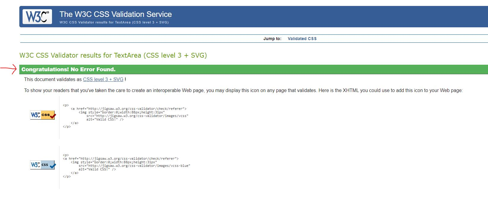

### Javascript Codes
- [JSHINT](https://jshint.com/) 
  - JSHINT was used for JavaScript code warning & error check. all codes passed the test without any error

    
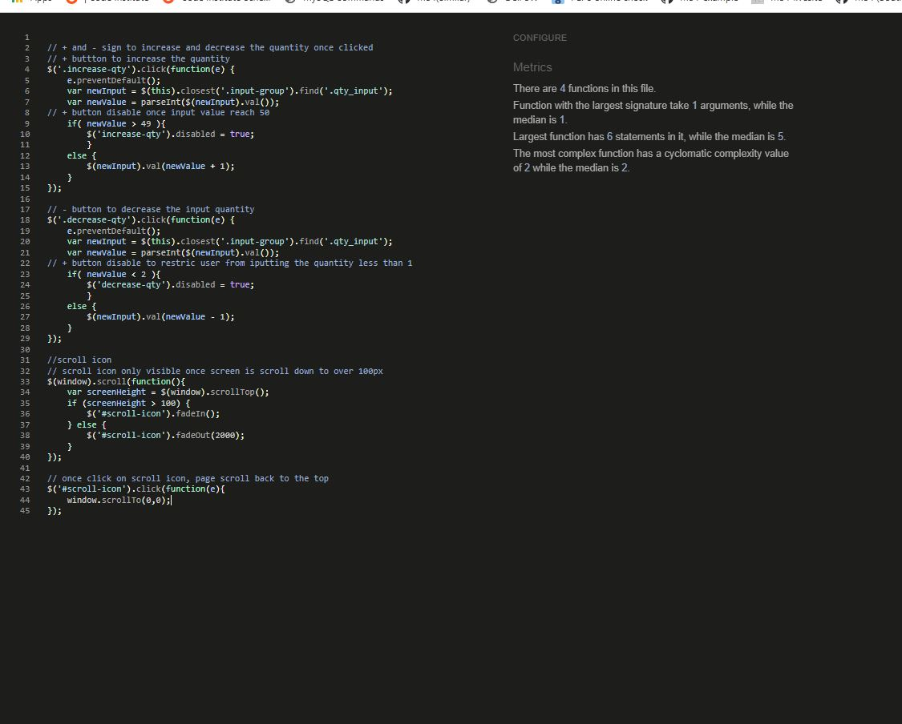

### Python Codes
- [PEP8 online](http://pep8online.com/)
  - PEP8 online tool was used to ensure all python codes on projects are PEP8 compliant. all codes were PEP8 compliant.

    
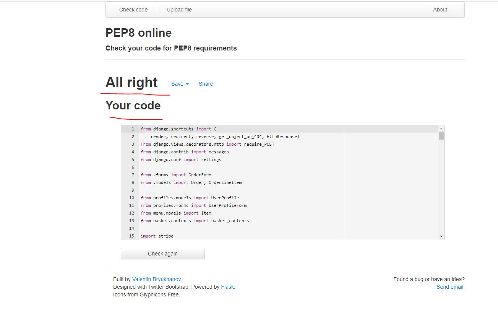

 

## Testing User Stories

### Customer
- As a Customer, I want to be able to view all of the available menu so that I can identify the image, price, information, and review
  - Clicked on the Menu option on the navbar which then took me to the all menu page, where I was able to see all the menu available, all item showing with correct name, price and corrcet category.
  - No issue with image loading, all the images and information fully responsive on all devices.
  - Clicked on the item image for item information then I was ble to see item information and all the item reviews below the image, item without review shown as Reviews(0)

- As a Customer, I want to be able to view specific category from the available menu so that I can identify the image, price, information, and review which suitable for my diet
  - All the items on the menu displayed with correct category such as lamb, chicken, fish etc. I was able to view all the category directly from the navbar by selecting the options and each option has sub-option to filter the category even in more organizing way
  - Clicked non-veg option on the navbar and choose lamb from the sub-option : only lamb dish displayed on the menu with category lamb on each item
  - Clicked on the Veg-meal option on the navbar and choose rice option from the sub-option: only rice item displayed on the menu with category rice on each item
  - Each items on the menu shown with clear image and price, upon clicking on the image I was able to see item information
  - pages were fully responsive, no overlapping or content hiding issue

- As a Customer, I want to be able to easily identify promotions, such as discounts and / or special offers so that I can Take advantage of extra savings on the menu and reduction of my total spending
  - Upon entering the site there was clear flash message informing on free delivery if I spend £20 on my order, I added one fish item to my basket and upon checking on basket there was extra £1.45 added for delivery charge however clear message was displayed stating that I could get free delivery by just spending £5.50 more, I then add another item to make my order over £20 then no charge shown.
  - I was still able to see all the price and message clearly while viewing on small device too, additionally shopping basket total, delivery charge and message were shown on the top of the page while viewing on mobile devices which is clear indication of no issue on identifying any promotions or saving on site.

- As a Customer, I want to be able to view / access the interesting articles via blog so that I can to get useful knowledge and read interesting information about the food and traditions
  - Clicked on the blog option on the navbar, it took me straight to the blog page without any issue where I saw few post which was nicely presented with clear image and blog title, button was displayed below image with Read More text, upon clicking on the button, Page redirect to the post info page where full details on the post were displayed with title of the post, image and description, checked the image if its get distorted or stretch while switching the small and large devices however no issue and images and all contents fully responsive

- As a Customer, I want to be able to select from the available the menu and manage/adjust the order quantity so that I can place the order into basket and easily make changes to my order before check-out
  - Clicked on the item image on the menu page, item info page displayed with item price, description, image and option to add item to the basket. input form was displayed below item information to allow to add the quantity and + and - button to adjust the quantity. Added 1 to the input form and click + button: wuantity changed to 2, then clicked - button and this time quantity changed to 1, Clicked add to basket button and success toast message appear with basket summary and button to select basket or checkout. Clicked on basket button and new page shown with detailed information on my basket. No other contents was displayed to this page except basket summary which was very good to see the basket summary in details.
 Additionally input form with + and - button along  with remove and update option, upon clicking on the + and - button and selecting remove or update option, noticed that quantity updated corrcetly and success message shown after I adjust the basket, also clicked on button which with text ADD MORE ITEMS and I was redirected back to menu page. This has satisfy that functionality to add the item to basket and adjust the quantity working well.

- As a Customer, I want to be able to easily check my basket so that I can ensure I do not accidentally select the wrong products and / or quantity
  - Clicked on the basket option from the navbar, my basket summary displayed with item details, return to the home page and then select menu page and add few more items to the bsaket and then view basket summary, item previously added was still showing in the basket. Added one more item from the menu and success message displayed with button to go to the basket page, clicked the button and I was redirect to the basket page. This conclude that user has great control over the item selected and basket.

- As a Customer, I want to be able to easily check the total amount of my order so that I can control and avoid unnecessary spending
  - Upon adding one rice item item to the basket, amount shown below the basket icon on the navbar updated as it was initially 0, removed the item from the basket and its changed to 0 again. I then add another item and click to view basket summary where I was able to see the total amount and delivery charge as well, I then add another item to make my basket over £20 then basket updated accordingly and delivery cost shown as £0.00 this time. this confirm that site has great functionality to calculate the cost and displaying the correct figures to the users

- As a Customer, I want to be able to feel my personal and payment information is safe and secure so that I can confidently provide the necessary information to place an order
- As a Customer, I want to be able to easily enter my payment information in a secured process so that I can check-out quickly with no hassle and protected payment
  - Entered personal details, delivery details and stripe test card details to the checkout form, selected save-info box and complete the order, card details were not shown anywhere in the browser and not shown in confirmation email, tried to make another order and once in checkout page this time, my details were already filled in the form and I only needed to enter the card details. This satisfy this payment is secured and protected as card details was not visible anywhere neither saved, also quick check-out duet to checkout form already prefilled

- As a Customer, I want to be able to view an order confirmation after check-out so that I can verify that my order has been placed and confirmed with no mistake
  - Created one order by completing the checkout form and order confirmation was shown on the screen immediately after my order completed, also received confirmation email to my email with order details. Also loged into the site after sign out and the click on my account option from the account option of the navbar where I was able to see my last order.

### Site User

 - As a site user, I want to be able to easily register/create an account so that I can have my personal account and be able to view my profile and transactions
 - As a site user, I want to be able to Receive an email confirmation after registering so that I can verify my account and ensure the registration was successful
 - As a site user, I want to be able to Easily login and / or logout so that I can access my personal profile, information and history transaction, also secure my account when not in use
   - Clicked on the register option on the navbar and filled the registration form, I then received an email with link to verify my account, clicked on the link and email verified. I then used the same login details to login to the page and I was logged in and also success message shown. I then placed one order by completing the checkout form and selected the save-info box. I then logout and log in again then select my account option, I was able to sse my last order and my information, upon clicking on the order number shown I was then able to see full order summary of my last order. I then Logout from the page and after this I was only able to see login and register option on account. I have also copied the URL from the browser while I was signed in and then paste the URL into different browser, however I was redirected to login page.

- As a site user, I want to be able to easily recover my password in case I forget about it so that I can Recover the access to my account and use the website
  - Clicked forgot password option on sign in page and provided with my email, received link to reset the password and upon clicking on the link redirected to the page where I was aksed to provide new pasword twice, completed this process and tried login with updated password and I was loged in to the page

- As a site user, I want to be able to add reviews to the available menu so that I can provide useful feedback for other customers and help them to select the favorite menu
  - Logged into the page and selected add review option on the review section, filled the review form and added. viewed on the item info page and my review was shown in the page below item 

- As a site user, I want to be able to add comments to the articles in the blog so that I can interact with other users or customers and share interesting information related to the articles
  - Logged into the page and selected add review option on the post on the blog, filled the comment form and click post. comment shown below the post in the blog page with delete button to delete my own comment

- As a site user, I want to be able to search the menu by name and/or description so that I can find a specific food from the available menu which I like to order
  - type lamb on search field and all lamb dish displayed, type ''slow' in the search field again and few dishes shown however none of them named slow, clicked on the item image and checked item information all item displayed had word 'slow' in their description. This conclude that item can be search either by name or by any word that match with item's information

- As a site user, I want to be able to sort a specific category from the available menu so that I can easily find the menu from specific category by cheapest price, most expensive price and alphabetical order to suit my diet
  - Clicked sort option on the menu page and selectet sort by price(low to high), item with low price displayed on top and item with most higher price was displayed on the bottom, similarly selected sort by alphabet (A to Z) and items were displayed in alphabetical order starting from A, lastly selected sort by alphabet (Z to A) and this time items were displayed in reverse alphabetical order starting from Z. This conclude that sorting functionality is working in this site

### Admin User
 - As an Admin user, I want to be able to add a new menu so that I can introduce new menu to my customers
   - Logged into the page with superuser login details and select Admin option from account option, I was welcomed with the form to fill, I then filled the form and click add button, ater viewing back to the menu page added item was shown in the page. Logged out and logged in again with other login details without superuser access, this time there was no admin option shown. This clearly indicate that adding new menu is only for supersuers

- As an Admin user, I want to be able to delete the menu and edit/update a menu so that I can change the prices, descriptions, images and other information of the food
  - Logged in to the page with superuser login and visited menu page, all of the items had edit and delete button, upon clicking edit button, form displayed with prefilled information and I have changed the price on the form and updated, upon checking back to menu page item price was updated. I then tried to update the description and image, all updated without any issue. Similarly clicked on delete button and item removed from page.
  I have then logged in as non-superuser, this time edit/delete buttons were not on the page. This conclude that only admin user can edit/update the menu.

- As an Admin user, I want to be able to add a new article to the blog so that I can allow users and customers to find and read new interesting article and information
  - Logged in to the page with superuser login and visited blog page, as soon as I entered to the page there was a button with text Add Post, I clicked on the button and page appear with form which had fields : Title, content and image. I then filled the form and also added image and submit the form. I then checked back to to blog page and post I added was shown in the blog. I then logout and logged again as non-superuser, this time Add Post button was not on the page. This conclude that only admin user can add the post/article to blog

- As an Admin user, I want to be able to edit/update an article in the blog so that I can change the details in the article to reflect the latest information, I also want to be able to delete an article in the blog so that I can remove obsolete articles from the blog
  - Each article/post had edit/delete buttons when logged in as a superuser, once edit button clicked form appeared on the page which has prefilled infromation on the post, I changed som etext on the content field and updated, Upon checking back to the same post again, text information were updated. This means edit/update functionality is working. I then clicked on the delete button which then removed the post from the blog. Upon checking on Django admin deleted post was not there too.
 I have then logged out and logged in with non-superuser login details and this time edit/delete buttons were not shown on the page which satisfy that only admin/superuser able to perform this

## Defensive Programming and Security
### Security
- For security reasons I have followed standard practices and used os to declare the environmental variables for all of my sensitive information.
- For Development, these variables are declared in the settings section of gitpod.
- By doing this it means that sensitive information such as passwords and secret keys never expose to public.
- To deploy on Heroku these environmental variables are also placed into thee config variables section of Heroku Setting.

### Users passwords.
- I have used Django all auth to handle the user's login and signup.
- This stores the users password as a hashed key for security.
- It also force the users to confirm their emails as an extra layer of security.

### Defensive Programming.
- I have added various codes in my project to make sure site can not be access by copy the url and pasting into different browser, I have tested this to ensure that logic behind this is working and error shown in the browser or redirect the user to somewhereelse if trying to access the brouser using url copied. 
- To test above, I copied the url from my running site when I was in the admin section of the page, I then paste the url to different browser which then showed me error straightway. I have carried this test with all the page urls from the website and I was not able to access the page and getting errors all the time ehen accessing page by using url

### Manual Testing

#### Navbar and Navigating functionality test

 - All the nav-link items were shown correctly, clicked on every links and they were redirecting to the correct page dropdown option were showing their sub-links and they were also redirecting to the right page once clicked
 - Layout of the Navbar changed while viewng on small/medium devices, Navbar toggler icon appear and all nav-links items were showing upon clicking on the icon, collapsing behaviour of toggler icon was functioning well 
 - Account, Basket and Blog options were still showing on the top of the page while viewing on small/medium devices and they were not hidden as expected, also clicked on each option and they were working.
 - Search field tested to ensure that functionality is working, typed 'lamb' on the search field and all lamb dish shown in the page, then typed 'gkgkgkjg' and no items shown. similarly typed 'homemade' and 1 item found which had homemade word on the item description. This now satisfy that Item can be search by using any word from the item name and also any matching word on the item description

  - 
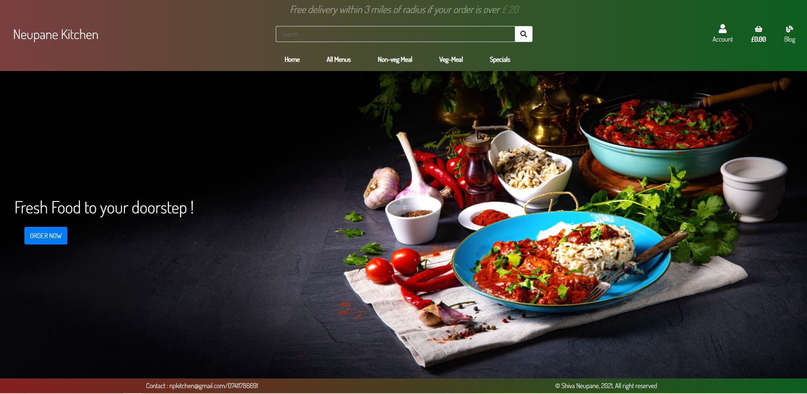

  - 
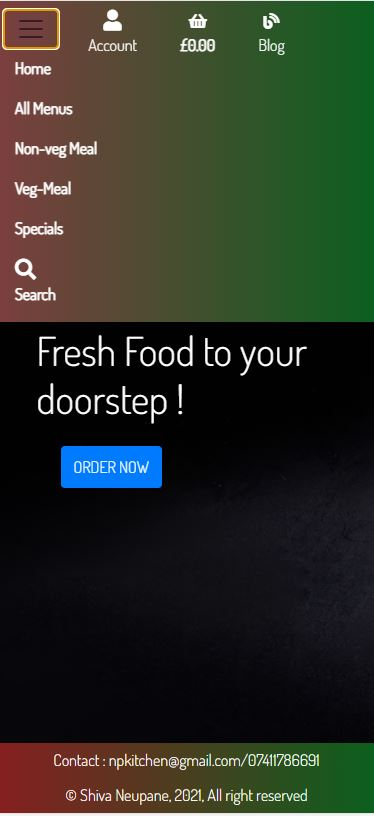

  - 
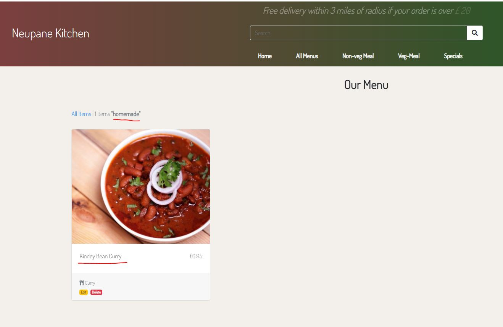

#### Homepage test 
- All Navigating options were tested from the home page and they were recirecting to the correct page, button on the centre of the page tested to ensure that its function as expected, clicked on the 'Order now' button and redirected to the main menu page, all the elements on the page were fully responsive

#### Menu page test
- Clicked All menu page and all the item images with their name, price and categories name displayed, number of item on the page shown on top left of the page and sort option was shown on the right, deleted one item from the page and number of item shown on top has changed, similarly select the sort box and sort options shown as dropdown, clicked all the dropdown options and they were populating the right item on the page
- Edit and delete buttons on the image tested using supersuer login details, clicked on edit button and form appear on the page which was prefilled with item information, tried chnaging the input in the form and clicked update button, updated information displayed to the page. Similarly delete button was clicked and item removed from the page.
- All the images and imformation on the pages were fully responsive across all devices.

  - 
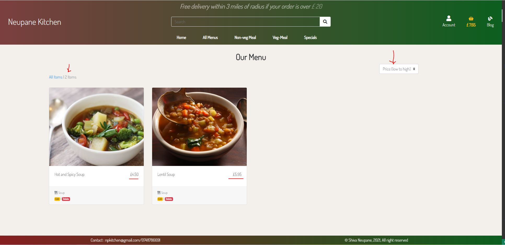

  - 
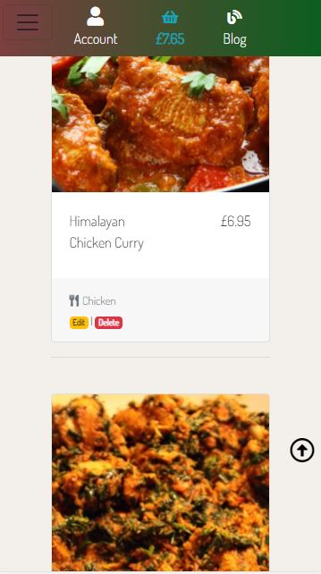

#### Item Info page
 - Clicked on the image item from the menu page which then display item info page. Image, information and price of the item shown with input field and +/- button,
 typed 1 in the input field and clicked both buttons + and - one by one, noth buttons were functioning as expected, input changed to 2 when + button clicked and changed to 1 again after - button clicked.
 - Add to the basket button clicked and success message shown with basket summary
 - Order More button clicked, redirected back to the menu page
 - All the item reviews were shown below the item image with option to add the review.
 - All elements on the page were fully responsive and no issue identified

   - 
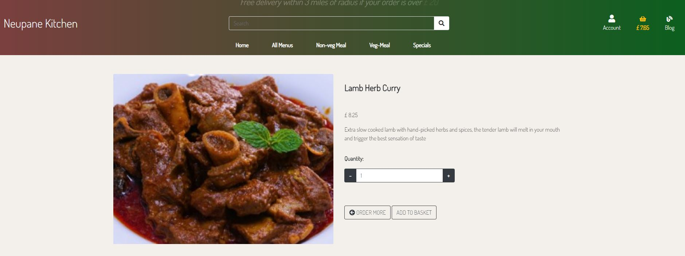

   - 
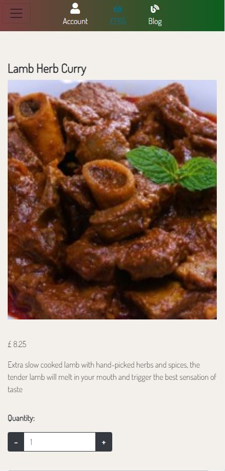

#### Basket page
 - Basket page were showing the correct baket information with Image, name, item price, and delivery charge. also page had an option to update/ remove the quantity
 - Tested quantity input form and +/- button by clicking on them and information was updated after every action and also success message with basket summary shown in the screen everytime when any change made to the quantity
 - Clicked on Add more button and page redirected back to main menu, also clicked on Secure Checkout button which then redirect to checkout page
 - All elements on the page were fully responsive and all the rows and cols were stacked correctly while viewing on the mobile devices

  - 
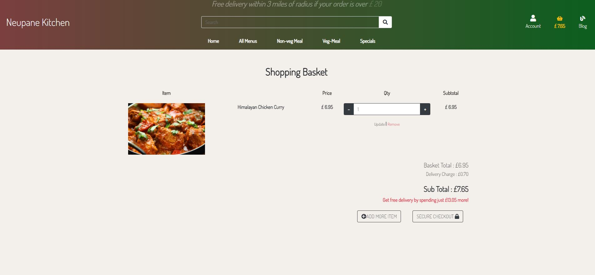

  - 
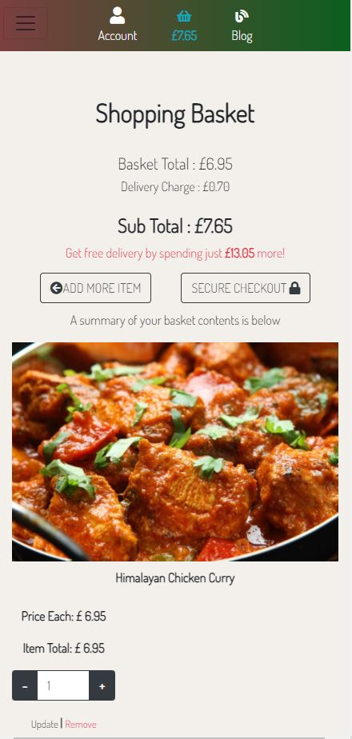

#### Blog page
 - Click on the ‘Blog’ menu, display the ‘Blog’ page which show all the available blogs then Click on the desired blog / article which then Redirect to the article page which display the detail information
 - Successfully display the ‘Blog’ page with all the available blogs / articles Successfully display the contents of selected blog / article 

  - 
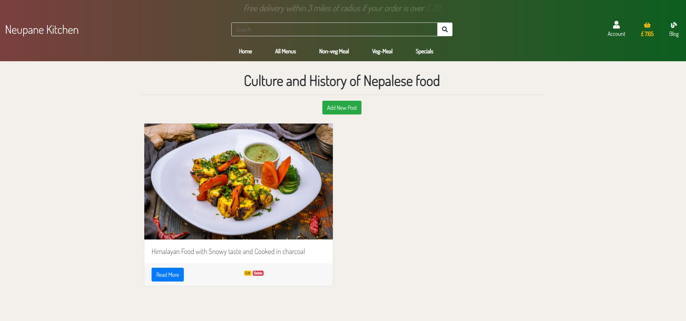

   - 
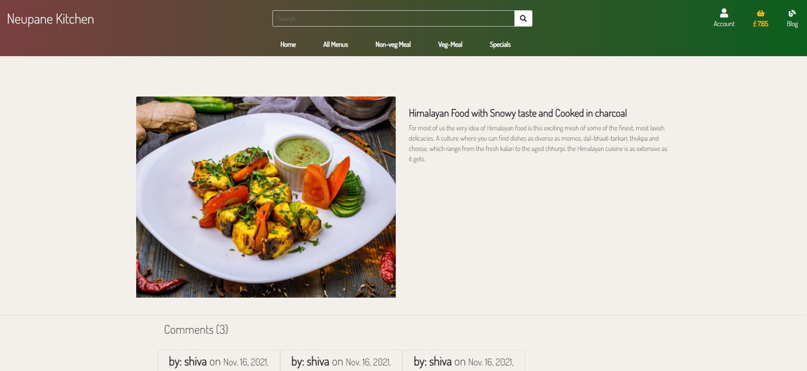

#### Login/Register functionality

  - Click on the ‘Register’ menu, Display Register / Sign-Up page with the form to fill-in the user details, Fill-in the user details Click the ‘Sign-Up’ button
  - Successfully select the ‘Register’ option
  - Successfully display the ‘Sign-Up’ form
  - All the fields are accessible and ‘Sign-Up’ form is now completed Successfully click the ‘Sign-Up’ button
  - Success message show up on the top right of the page to inform the user
  - Email notification is sent to the registered email for user validation
  - Filled in the form with only 2 character, validation error shown and registration process failed, entered an existing email address to register, error message shown informing that email already exist
  - same process repeated to check login functionlaity by selecting the login option, provided incorrect email/ password and validation error shown

     - 
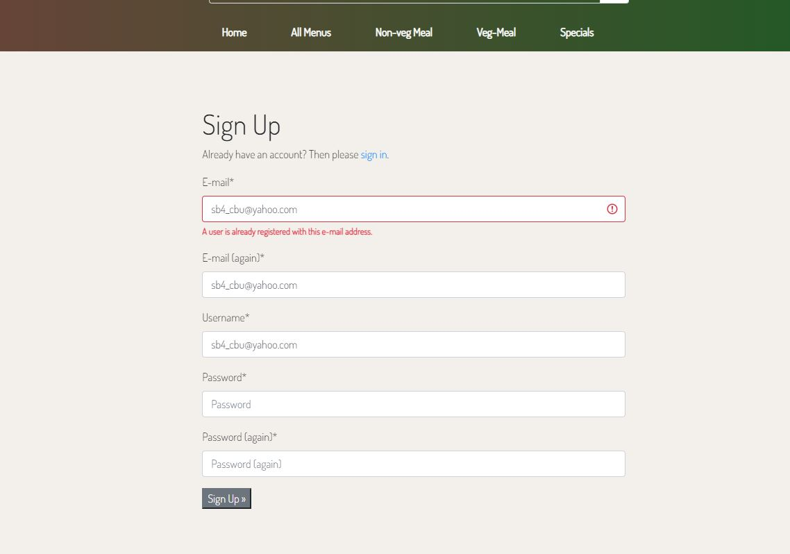

     - 
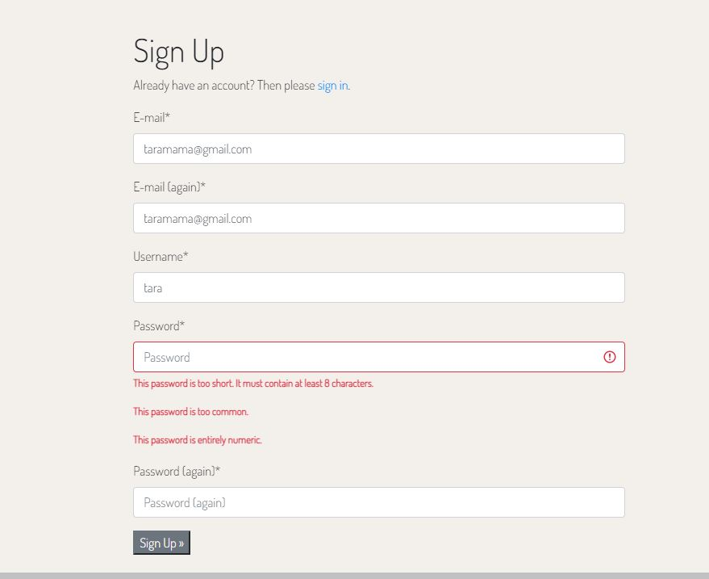

#### Checkout functionality
 - Checkout page had all the basket summary displayed and also payment form that required to complete in order to process the order
 - Entered All the delivery details and personal info, then select save info box to store my details to the database, privided stripe test card details on the payment field and clicked complete order, loading spinner appear on the page and confirmation message displayed on the screen
 - Added incorrect card nummber and also added past date on the card expirt date, on both occasion validation errors shown

   - 
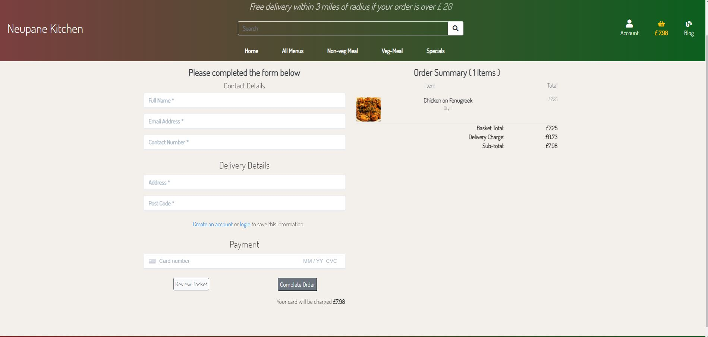

   - 
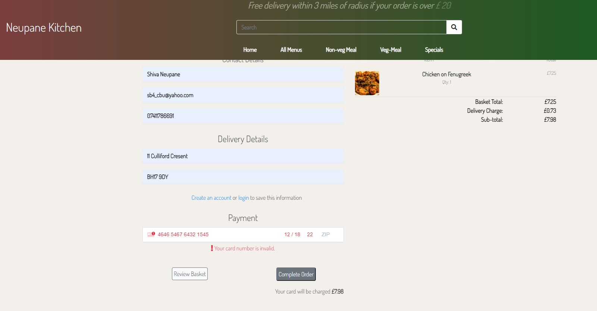

   - 
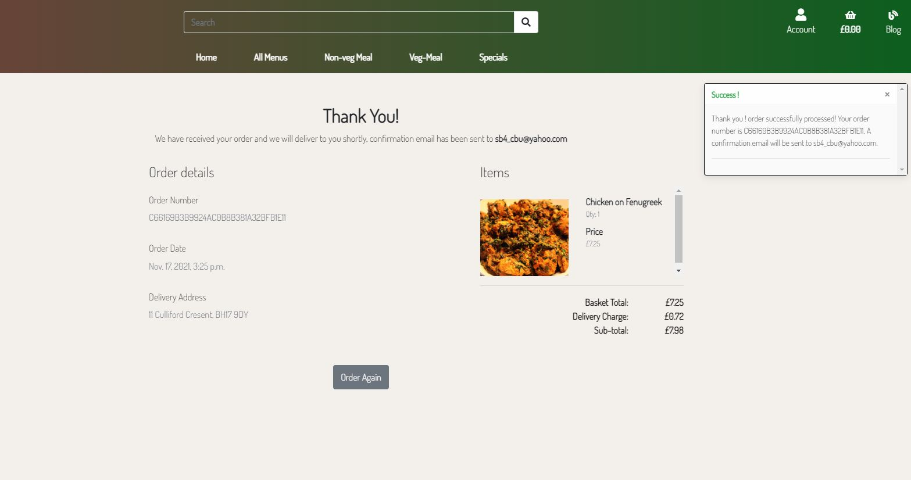

#### Add/edit/delete Review and comment
 - Clicked on the add review form on the item info page and form appear on the page, after filling and submit the form review then sppear on the page, also edit and delete options were appeared on the review that I made, however no option for edit/delete the review made by other user. both edit and delete buttons were tested and they were functioning as expected, review deleted from the page once I click delete button and i was able to edit my review by selecting edit button.
- I have then tested comment section in the blog page in same way and all functionality was working

 - 
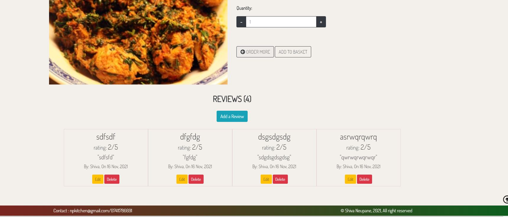

 - 
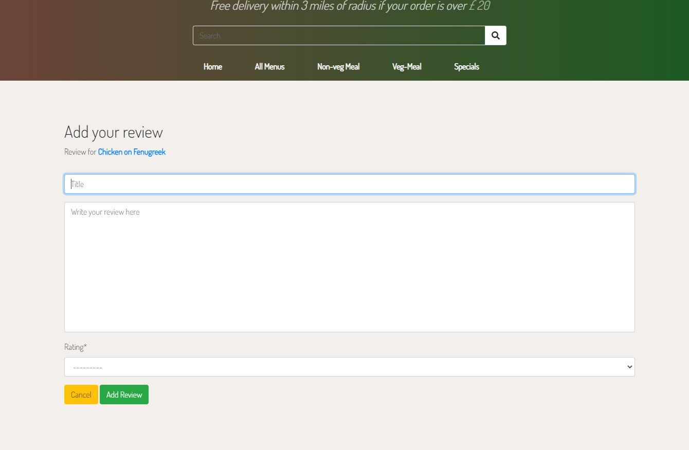

 - 

All above test have now conclude that functionality on the site is working without any issue and is fully responsive 
